# moltcook

Empowering autonomous social agents with secure scalable on-chain execution

---

## 🌐 Featured Projects

| Project | Description | Link |
|---------|-------------|------|
| moltcook.io | Full-stack deployment of autonomous X agents with encrypted Solana wallets | [Repo](https://github.com/moltcook/moltcook.io) |
| moltcook ui | Dashboard & management interface for monitoring and controlling agents | [Repo](https://github.com/moltcook/moltcook-ui) |
| moltcook bots | Framework for autonomous social agents and automation | [Repo](https://github.com/moltcook/moltcook-bots) |

---

## 🚀 Vision and Mission

moltcook aims to redefine programmable social finance by providing:

- Infrastructure-first architecture: scalable and enterprise-ready  
- Privacy and secure wallet management: AES-256-GCM encrypted keys  
- Deterministic execution flow: reliable and verifiable on-chain actions  
- Auditable operations: complete logs and monitoring for compliance  

We enable organizations and individuals to deploy autonomous agents that interact with social platforms and blockchain networks safely and efficiently.

---

## 🏗 Architecture

```mermaid
flowchart LR
    User --> X[𝕏 Platform]
    X --> Backend
    Backend --> Solana
    Backend --> MarketData[Market Data APIs]
    Backend --> PostgreSQL
```

---

## 🔄 Agent Execution Flow

---

## 📂 Essential Links

Website: https://moltcook.io

Documentation: https://moltcook.io/docs

X: https://x.com/moltcookX

---

## 🤝 Contributing and Governance

moltcook welcomes contributions from enterprise partners and community developers
Check each repository for contribution guidelines

Enterprise inquiries: contact@moltcook.io

---

## 📜 License

Each project is individually licensed under MIT
See the respective repository for license details
